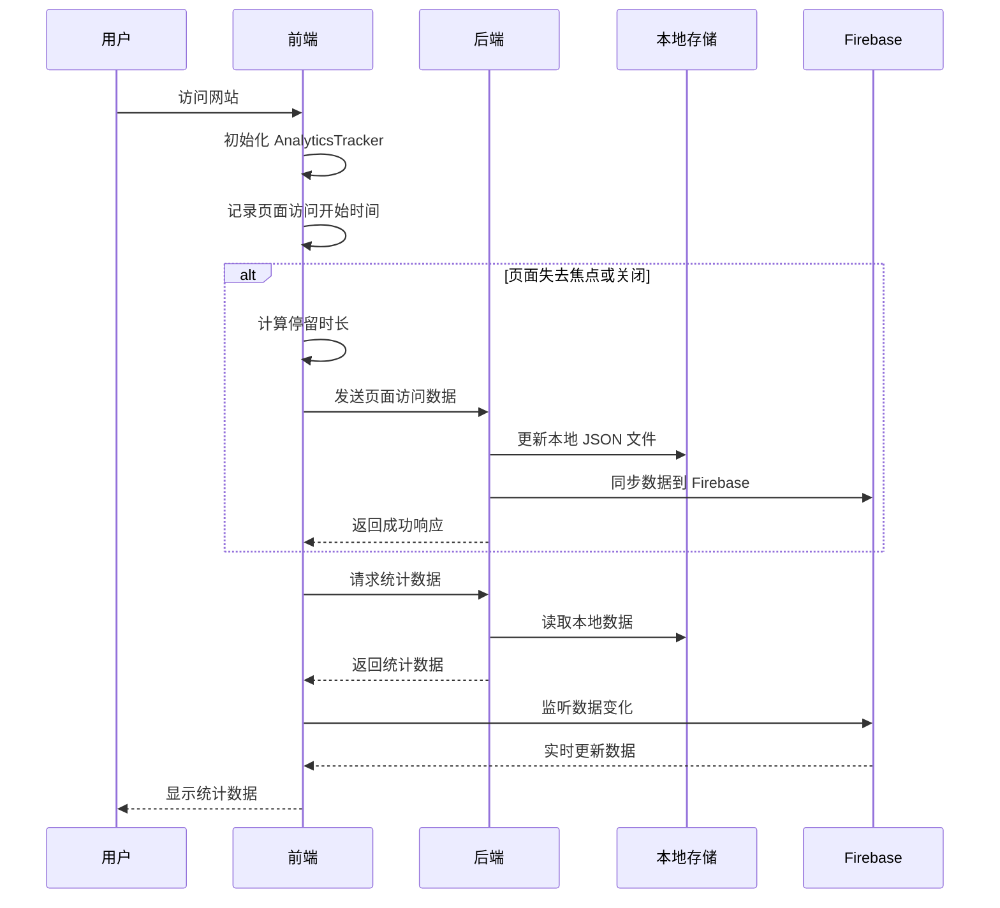

# OurNote 技术架构文档

## 1. 系统架构

### 1.1 整体架构

OurNote 采用前后端分离的架构设计，主要由以下部分组成：

- **前端**：Vue.js 2.x 应用，负责用户界面和数据展示
- **后端**：Express.js 服务器，负责数据处理和存储
- **数据存储**：本地 JSON 文件（开发环境）和 Firebase Realtime Database（生产环境）
- **部署**：支持部署到 Netlify，使用 Netlify Functions 作为后端

### 1.2 数据流



## 2. 核心模块

### 2.1 AnalyticsTracker

**文件路径**：`src/api/analytics.js`

**功能**：实现访客跟踪和页面访问数据收集

**核心实现**：

- **单例模式**：确保整个应用只有一个 AnalyticsTracker 实例
- **FingerprintJS 集成**：使用 FingerprintJS 生成唯一的访客 ID
- **页面可见性 API**：监听页面可见性变化，准确记录停留时长
- **心跳机制**：每秒更新一次累积停留时长
- **数据发送**：在页面失去焦点或关闭时发送页面访问数据

**关键方法**：

- `init()`：初始化 AnalyticsTracker
- `initFingerprint()`：初始化 FingerprintJS
- `setupEventListeners()`：设置事件监听器
- `startHeartbeat()`：启动心跳机制
- `getCurrentDuration()`：计算当前停留时长
- `sendPageView()`：发送页面访问数据
- `updatePagePath()`：更新页面路径

### 2.2 数据存储模块

**文件路径**：`server/storage.js`

**功能**：实现本地数据存储和读取

**核心实现**：

- **文件操作**：使用 fs 模块读写 JSON 文件
- **数据格式**：使用 JSON 格式存储数据
- **错误处理**：添加错误处理，确保数据操作的稳定性

**关键方法**：

- `loadData(key)`：加载指定键的数据
- `saveData(key, data)`：保存数据到指定键

### 2.3 后端 API 模块

**文件路径**：`server/server.js`

**功能**：实现后端 API，处理页面访问数据和提供数据查询接口

**核心实现**：

- **Express.js**：使用 Express.js 创建服务器和路由
- **CORS**：启用 CORS，允许跨域请求
- **数据处理**：处理页面访问数据，更新统计信息
- **Firebase 集成**：同步数据到 Firebase Realtime Database
- **缓存机制**：实现数据缓存，提高性能

**关键路由**：

- `POST /api/analytics/pageview`：处理页面访问数据
- `GET /api/stats/:key`：获取指定键的统计数据
- `GET /api/stats`：获取所有统计数据

### 2.4 数据可视化模块

**文件路径**：`src/views/NewsView.vue`

**功能**：实现数据可视化，展示网站统计信息

**核心实现**：

- **响应式设计**：适配不同设备尺寸
- **数据加载**：从后端 API 加载数据，优先使用本地 JSON 文件数据
- **图表展示**：使用 CSS 和 Vue 模板实现访问趋势图表和页面访问计数条形图
- **表格展示**：展示最近访问记录

**关键方法**：

- `initDataLoading()`：初始化数据加载
- `loadStatsFromAPI()`：从 API 加载统计数据
- `loadTrendData()`：加载访问趋势数据
- `loadRecentVisits()`：加载最近访问记录
- `loadPageStats()`：加载页面统计数据
- `calculatePageAccessData()`：计算页面访问数据，生成页面访问计数条形图

## 3. 技术实现细节

### 3.1 访客识别

使用 FingerprintJS 生成唯一的访客 ID，实现方式：

```javascript
async initFingerprint() {
  try {
    const fp = await FingerprintJS.load()
    const result = await fp.get()
    this.visitorId = result.visitorId
    console.log('Visitor ID:', this.visitorId)
  } catch (error) {
    console.error('Failed to initialize fingerprint:', error)
    this.visitorId = `fallback_${Date.now()}`
  }
}
```

### 3.2 停留时长计算

使用页面可见性 API 和心跳机制，准确计算页面停留时长：

```javascript
setupEventListeners() {
  if (typeof document !== 'undefined') {
    document.addEventListener('visibilitychange', () => {
      this.handleVisibilityChange()
      // 当页面失去焦点时发送页面访问数据
      if (document.hidden) {
        console.log('Page hidden, sending page view...');
        this.sendPageView();
      }
    })

    window.addEventListener('beforeunload', () => {
      console.log('Before unload, sending page view...');
      this.sendPageView();
    })

    window.addEventListener('unload', () => {
      console.log('Unload, sending page view...');
      this.sendPageView();
    })
  }
}

startHeartbeat() {
  this.heartbeatInterval = setInterval(() => {
    if (this.isVisible) {
      this.accumulatedDuration += Date.now() - this.lastHeartbeat
      this.lastHeartbeat = Date.now()
    }
  }, 1000)
}

getCurrentDuration() {
  let totalDuration = this.accumulatedDuration
  if (this.isVisible) {
    totalDuration += Date.now() - this.lastHeartbeat
  }
  return totalDuration / 1000 // 转换为秒
}
```

### 3.3 数据同步

使用 Firebase Realtime Database 实现数据同步，确保数据安全和一致性：

```javascript
async function syncDataToFirebase(siteStats, pageStats, recentVisits, durationStats, knownVisitors, todayStats) {
  try {
    const { ref, update } = require('firebase/database');
    
    // 初始化 Firebase
    const db = initFirebase();
    
    // 准备要更新的数据
    const updates = {};
    
    // 更新站点统计
    updates['siteStats'] = siteStats;
    
    // 更新页面统计，处理 Firebase 密钥命名限制
    const processedPageStats = {};
    Object.keys(pageStats).forEach(path => {
      // 将页面路径中的斜杠替换为下划线，以符合 Firebase 密钥命名限制
      const firebasePath = path.replace(/\//g, '_');
      processedPageStats[firebasePath] = pageStats[path];
    });
    updates['pageStats'] = processedPageStats;
    
    // 更新最近访问记录
    updates['recentVisits'] = recentVisits;
    
    // 更新停留时长统计
    updates['durationStats'] = durationStats;
    
    // 更新已知访客
    updates['knownVisitors'] = knownVisitors;
    
    // 更新今日统计
    updates['todayStats'] = todayStats;
    
    // 执行更新
    await update(ref(db), updates);
    console.log('Data synced to Firebase successfully');
  } catch (error) {
    console.error('Failed to sync data to Firebase:', error);
    throw error;
  }
}

// 从 Firebase 同步数据到本地
async function syncFirebaseToLocal() {
  try {
    const { ref, get } = require('firebase/database');
    const db = initFirebase();
    
    // 获取 Firebase 数据
    const snapshot = await get(ref(db));
    const firebaseData = snapshot.val();
    
    if (firebaseData) {
      // 处理页面统计数据，将下划线替换回斜杠
      if (firebaseData.pageStats) {
        const processedPageStats = {};
        Object.keys(firebaseData.pageStats).forEach(firebasePath => {
          const originalPath = firebasePath.replace(/_/g, '/');
          processedPageStats[originalPath] = firebaseData.pageStats[firebasePath];
        });
        firebaseData.pageStats = processedPageStats;
      }
      
      // 保存数据到本地文件
      if (firebaseData.siteStats) await saveData('siteStats', firebaseData.siteStats);
      if (firebaseData.pageStats) await saveData('pageStats', firebaseData.pageStats);
      if (firebaseData.recentVisits) await saveData('recentVisits', firebaseData.recentVisits);
      if (firebaseData.durationStats) await saveData('durationStats', firebaseData.durationStats);
      if (firebaseData.knownVisitors) await saveData('knownVisitors', firebaseData.knownVisitors);
      if (firebaseData.todayStats) await saveData('todayStats', firebaseData.todayStats);
      
      console.log('Data synced from Firebase to local files successfully');
    }
  } catch (error) {
    console.error('Failed to sync data from Firebase to local:', error);
    throw error;
  }
}
```

### 3.4 缓存机制

实现数据缓存，提高性能：

```javascript
// 数据缓存
const dataCache = {};
const cacheExpiry = {};
const CACHE_DURATION = 30000; // 缓存持续时间（毫秒）

// 检查缓存是否有效
function isCacheValid(key) {
  return dataCache[key] && cacheExpiry[key] && Date.now() - cacheExpiry[key] < CACHE_DURATION;
}

// 清除过期缓存
function clearExpiredCache() {
  const now = Date.now();
  Object.keys(cacheExpiry).forEach(key => {
    if (now - cacheExpiry[key] >= CACHE_DURATION) {
      delete dataCache[key];
      delete cacheExpiry[key];
    }
  });
}

// 定期清除过期缓存
setInterval(clearExpiredCache, 60000);
```

## 4. 部署配置

### 4.1 开发环境

**配置文件**：

- `server/server.js`：后端服务器配置
- `src/api/analytics.js`：前端 API 请求配置

**环境变量**：

- 开发环境：默认使用 `http://localhost:3001` 作为后端 API 地址
- 生产环境：使用相对路径 `/api` 作为后端 API 地址

### 4.2 Netlify 部署

**配置文件**：

- `netlify.toml`：Netlify 配置文件
- `netlify/functions/analytics.js`：Netlify Functions 实现

**部署步骤**：

1. 确保项目中包含 `netlify.toml` 配置文件
2. 确保 `netlify/functions/analytics.js` 函数存在且配置正确
3. 登录 Netlify 账号，创建新站点
4. 选择项目仓库，配置构建命令和发布目录
5. 点击 "Deploy site" 开始部署

**Netlify 配置示例**：

```toml
[build]
  command = "npm run build"
  publish = "dist"

[functions]
  directory = "netlify/functions"
  node_bundler = "esbuild"

[[redirects]]
  from = "/api/*"
  to = "/.netlify/functions/analytics"
  status = 200
  force = true

[[redirects]]
  from = "/*"
  to = "/index.html"
  status = 200
```

## 5. 性能优化

### 5.1 前端优化

- **延迟加载**：延迟初始化 Firebase 监听器，减少对页面加载速度的影响
- **缓存机制**：实现数据缓存，减少重复请求
- **响应式设计**：适配不同设备尺寸，提供良好的用户体验
- **代码分割**：按需加载组件，减少初始加载时间

### 5.2 后端优化

- **缓存机制**：实现数据缓存，提高响应速度
- **批量更新**：批量更新数据，减少数据库操作次数
- **错误处理**：添加详细的错误处理，提高系统稳定性
- **日志记录**：添加详细的日志记录，便于调试和监控

### 5.3 数据存储优化

- **本地存储**：开发环境使用本地 JSON 文件，提高开发效率
- **Firebase**：生产环境使用 Firebase Realtime Database，确保数据安全
- **数据同步**：定期同步数据，确保数据一致性

## 6. 监控和维护

### 6.1 日志系统

- **前端日志**：使用 `console.log` 记录关键操作和错误
- **后端日志**：使用 `console.log` 和 `console.error` 记录请求处理和错误
- **Firebase 日志**：Firebase 控制台提供详细的日志信息

### 6.2 常见问题排查

**问题**：数据不同步

**排查步骤**：
1. 检查后端服务器是否运行正常
2. 检查 Firebase 配置是否正确
3. 检查网络连接是否正常
4. 检查前端是否正确发送数据
5. 检查后端是否正确处理数据

**问题**：页面访问数据不显示

**排查步骤**：
1. 检查 `pageStats` 数据是否存在
2. 检查后端服务器是否正确处理页面访问数据
3. 检查前端是否正确加载 `pageStats` 数据
4. 检查数据可视化代码是否正确

**问题**：访客跟踪不工作

**排查步骤**：
1. 检查 FingerprintJS 是否正确初始化
2. 检查前端是否正确发送页面访问数据
3. 检查后端是否正确处理页面访问数据
4. 检查 AnalyticsTracker 代码是否正确

## 7. 扩展性

### 7.1 功能扩展

- **新统计指标**：可以通过修改后端代码，添加新的统计指标
- **新数据可视化**：可以通过修改前端代码，添加新的数据可视化图表
- **新数据源**：可以通过修改后端代码，集成新的数据源

### 7.2 技术扩展

- **前端框架**：可以升级到 Vue 3.x 或使用其他前端框架
- **后端框架**：可以使用其他后端框架，如 Koa、Fastify 等
- **数据库**：可以使用其他数据库，如 MongoDB、PostgreSQL 等

### 7.3 部署扩展

- **容器化**：可以使用 Docker 容器化部署
- **云服务**：可以部署到 AWS、GCP、Azure 等云服务
- **CDN**：可以使用 CDN 加速静态资源

## 8. 总结

OurNote 是一个功能完整的个人网站系统，集成了访客跟踪、数据统计、内容管理等功能，支持部署到 Netlify。系统采用前后端分离的架构设计，使用 Vue.js 作为前端框架，Express.js 作为后端框架，Firebase Realtime Database 作为数据存储。

系统的核心功能包括：

- **访客跟踪**：使用 FingerprintJS 识别访客身份，记录停留时长
- **数据统计**：实时统计网站访问数据，包括总访问量、访问人数、平均访问时长等
- **页面统计**：记录每个页面的访问次数，生成页面访问计数条形图
- **访问趋势**：展示最近几天的访问趋势图表
- **最近访问**：显示最近的访问记录，包括访问时间、页面、停留时长等
- **数据同步**：自动同步数据到 Firebase 数据库，确保数据安全和一致性
- **响应式设计**：适配不同设备尺寸，提供良好的用户体验

系统的技术特点包括：

- **单例模式**：使用单例模式实现 AnalyticsTracker
- **页面可见性 API**：使用页面可见性 API 准确记录停留时长
- **心跳机制**：使用心跳机制实时更新停留时长
- **Firebase 集成**：使用 Firebase Realtime Database 实现数据同步，处理密钥命名限制
- **本地优先**：优先使用本地 JSON 文件数据，提高性能
- **缓存机制**：使用缓存机制提高性能
- **Netlify 部署**：支持部署到 Netlify，使用 Netlify Functions 作为后端
- **自动同步**：实现本地数据与 Firebase 数据库的双向自动同步

OurNote 系统具有良好的扩展性和可维护性，可以根据需要添加新功能和集成新技术。系统的设计考虑了性能优化和数据一致性，确保在不同环境下都能稳定运行。